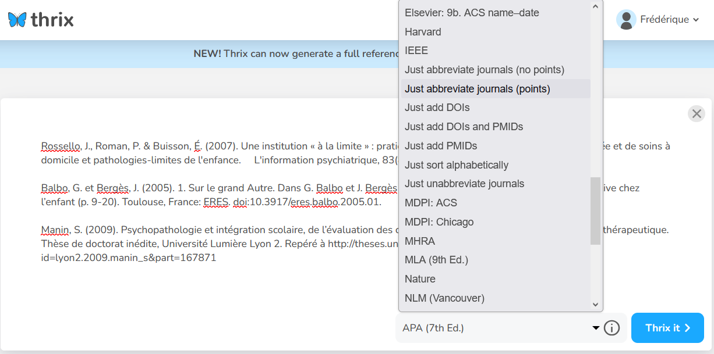
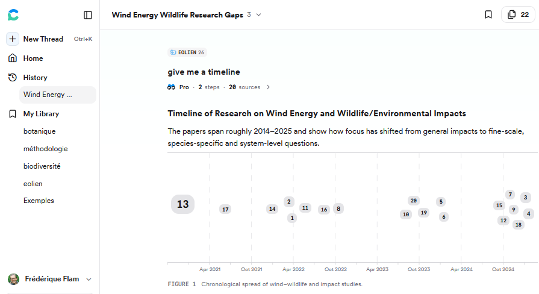

# Introduction

## Objectifs

-   Appréhender les enjeux techniques et éthiques du recours à l’intelligence artificielle pour la rédaction et la gestion bibliographiques.
-   Identifier les atouts et les limites des services d’intelligence artificielle aux différentes étapes de la rédaction et de la gestion bibliographiques, de l’import et de la mise en forme des références bibliographiques à l’exploitation d’une bibliothèque de PDF.
-   Installer et utiliser des services d’intelligence artificielle dans Zotero.

## Programme

-   Contexte et enjeux
-   Typologie des usages, services et outils d’intelligence artificielle pour la rédaction et la gestion bibliographiques
-   Mise en application dans Zotero : de l’IA à toutes les étapes de la bibliographie ?

# Contexte et enjeux

## Usages académiques l'IA générative (_GenIA_)

Rédaction et gestion bibliographiques à la croisée de 2 sphères d'activités, dont elles partagent en partie les enjeux :

* recherche bibliographique,
* écriture académique.

:::aside
Pour une vue complète concernant la recherche bibliographique, voir toutes les ressources d'A. Bouchard, et notamment son article sur le blog des Urfist [@bouchard2025WorkInProgressIA] et son cours sur Callisto [@bouchard2025IARecherche].
:::
## Usages académiques de la _GenIA_ : recherche {.smaller}

* Au moins **60'000** articles en 2023 écrits avec l'assistance d'un LMM - soit 1% des articles indexés dans Dimensions ; **10%** des articles en biomédecine du 1er semestre 2024 pour lesquels le résumé écrit avec l'aide d'une IA [@lenharo2024ChatGPTTurns].
* Enquête auprès de chercheurs et doctorants danois début 2024 [@andersen2025GenerativeArtificial] - 3 profils d'usages :
    * _GenIA_ comme une **bête de somme** (_work horse_) : 35,2% des répondants - _GenIA_ pour modification code informatique, analyses statistiques, etc.
    * _GenIA_ comme un **assistant linguistique** (_language assistant_) : 24% des répondants - _GenIA_ uniquement pour amélioration rédaction, y compris mise en forme des références.
    * _GenIA_ comme un **accélérateur de recherche** (_research accelerator_) : 40,7% des répondants - _GenIA_ pour tous les usages, en particulier analyse de données.

## Usages académiques de la _GenIA_ : recherche {.smaller}

![Types de mentions de ChatGPT dans les publications scientifiques indexées par Web of Science et Scopus. [@kousha2024HowChatGPT]](img/fig1_chatgpt_acknowl.png)

## Usages académiques de la _GenIA_ : étudiants {.smaller}

![Types d'outils utilisés par les étudiants en France - [@pascal2025IAEnseignement]](img/etudiants_outils.png)

  
## Rappels techniques

!["Fonctionnement des IA" dans le cours d'A. Bouchard - [@bouchard2025IARecherche] - [Consulter l'infographie en ligne](https://callisto-formation.fr/course/view.php?id=952#module-22173)](img/ABouchart_fonctionnement_IA.png)

## Les différents types d'IA : du _chatbot_ à l'IA agentique

![L'évolution de la recherche [@zhao2025EmergingAI] - voir aussi du même auteur [A Snapshot of GenAI Tools for Research ](https://library.hkust.edu.hk/news-events/news/snapshot-genai-tools-research)](img/zhao_search_evolution.png)

## _GenIA_ généralistes et académiques

![ [@zhao2025EmergingAI] Les _GenIA_ académiques sont fondées sur le _RAG_, _Retrieval-Augmented Generation_, ou génération augmentée de récupération.](img/zhao_IAgen_academ.png)

## Focus sur le RAG 

![_GenIA_ simple vs. _GenIA_ avec _RAG_ - [@bouchard2025FormerUsagers]](img/genIA_vs_RAG.png)

## Focus sur le RAG {.smaller}

2 points clés distinguent les _GenIA_ académiques utilisant le _RAG_ des _GenIA_ généralistes.

* **Sources de données spécifiques** : l'instruction est augmentée avec le contexte récupéré de sources de données externes spécialisées = bases de données bibliographiques. NB **Semantic Scholar** est la principale et souvent l'unique base utilisée comme source. 
* **Extraction** des données et non seulement génération pour construire la réponse.

👉 Réponses plus précises, contenu non inventé, vérifications plus simples...

... mais enjeux de **fidélité à la source** : les réponses extraites ne constituent pas forcément l'objet principal de l'article, ou résultent d'une mauvaise interprétation, ou encore la réponse générée est factuellement vraie mais ne peut pas être confirmée par la source.

:::aside
Voir [@bouchard2025WorkInProgressIA] : p. 13 ; voir également p. 31 sur les IA agentiques
:::

## Enjeux du recours à l’IA pour la gestion et la rédaction bibliographiques {.smaller}

Rappel non exhaustif du rôle des citations dans les écrits académiques :

* fournir des sources en appui aux assertions,
* permettre la vérification de ces sources,
* établir la paternité des contributions,
* mettre en évidence l'étendue et la profondeur de la recherche menée sur un sujet.

Pour cela les citations doivent être [1] **exactes** et leur sélection [2] **pertinente** et [3] **objective**, du moins [4] **non biaisée**.

🤔 Ces qualités caractérisent-elles généralement les produits d'une _GenIA_?

## Enjeu [1] d'exactitude : erreurs et hallucitations {.smaller}

Les capacités imaginatives des _GenIA_ s'exercent aussi pour les références bibliographiques, produisant au mieux des références inexactes et au pire des références inventées, les "hallucitations".

Cela a des impacts **globaux** sur la littérature académique.

* Les hallucitations participent à la diffusion de fausses références dans la littérature académique - voir [@orduna-malea2023ChatGPTPotential] et [@camp2025CitationCatastrophe].
* Les erreurs de DOI faussent les **comptes de citations** et génèrent des liens incorrects.

## Pourquoi les _GenIA_ hallucitent-elles? {.smaller}

* _GenIA_ conçue pour générer des réponses prioritairement **cohérentes et plausibles** plutôt qu'exactes, et qui suscitent un retour positif de l'utilisateur.
* _GenIA_ ne sait pas distinguer les références bibliographiques du texte courant.

👉 Système de transformation de texte et non de recherche d'information.

* Dépend de la fréquence d'apparition des références dans les données d'entraînement? Les **livres** et les **articles très cités** seraient moins sujets aux hallucitations. 

:::aside
Voir : [@resnik2025EthicsUsing; @cabezas-clavijo2025AssessingPerformance; @oladokun2025HallucitationScientific; @walters2023FabricationErrors]
:::

## Enjeu [2] de pertinence

La pertinence du choix des citations est affectée par :

* la **couverture** des données et bases de données sources (y compris pour les IA académiques),
* les **algorithmes** aboutissant à la sélection des résultats, ou l'effet "boîte noire" (y compris pour les IA académiques),
* le fait que les citations sont le plus souvent de 3ème main. Les IA tendent à fournir des références citées sur des pages Wikipedia ; le **texte intégral** des sources n'est pas intégré dans les données d'entraînement de toutes les IA.

## Enjeu [3] d'objectivité {.smaller}

::::: columns
::: {.column width="40%"}

Illusion d'objectivité: croire que les outils d'IA n'ont **pas de point de vue** ou sont capables de représenter **tous les points de vue** possibles, alors qu'ils intègrent les points de vue de leurs données d'entraînement et de leurs développeurs.

_[traduction adaptée de la légende de la figure]_
:::

::: {.column width="60%"}
![Fig. 1: Illusions of understanding in AI-driven scientific research. c Illusion of objectivity [@messeri2024ArtificialIntelligence]](img/illusion_objectivite.png)
:::
:::::

## Enjeu [4] des biais {.smaller}

* Fort recouvrement des réponses fournies par des chatbots différents 👉 réponses des AI contraintes à un cadre intellectuel étroit 👉 renforcement du biais de **confirmation** et des paradigmes existants
* Renforcement de **l'effet Matthieu** : auteurs les plus cités = les plus fréquents = les plus à même d'être présents dans les réponses des IA (y compris dans les hallucitations)

:::aside
Sur l'enjeu de pertinence et le renforcement des biais, voir notamment : [@bouchard2025WorkInProgressIA; @spennemann2025OriginsVeracity; @cabezas-clavijo2025AssessingPerformance; @orduna-malea2023ChatGPTPotential; @lund2023ChatGPTNew]
:::

## Risques et opportunités {.smaller}

* Illusion non seulement d'objectivité, mais aussi de **profondeur explicative** et de **largeur explicative** 
* Risque de **perte de compétences** : notamment celles d'interprétation, évaluation et analyse, mobilisées par l'activité bibliographique
* Opportunités : pour certaines tâches répétitives telles que l'encodage d'une liste (textuelle ou tabulée) vers un format informatique bibliographique ou la réécriture de citations et de bibliographie d'un style vers un autre ?

  👉 Réponse dans quelques minutes 🕰️

:::aside
Sur les risques voir notamment [@messeri2024ArtificialIntelligence; @hutchins2025EveryReason; @maraninchi2025PourquoiJe]
:::
# Typologie des usages, services et outils d’intelligence artificielle pour la rédaction et la gestion bibliographiques

## Générer une bibliographie prête à l’emploi {.smaller}

Ou obtenir à partir d'une instruction (_prompt_) formulée à une _GenIA_ une sélection de références rédigées, en sollicitant une IA généraliste ou une IA académique spécialisée.

Différentes évaluations des performances avec des conclusions partagées : 

* la persistance y compris dans les modèles les plus récents et les IA académiques de problèmes structurels tels que les hallucitations et l'inexactitude des métadonnées,
* et donc la nécessité de tout vérifier et de tout relire...

## Évaluation des bibliographies produites par les _GenIA_ : les problèmes 1/2 {.smaller}

Les études évaluant les performances des _GenIA_ relèvent différentes catégories d'anomalies et d'erreurs, sur le fond et/ou la forme.

* **La pertinence du choix des citations** : voir _supra_. 
* **Le respect du style demandé** : voir _infra_ ; nous verrons ce point en détail concrètement quand nous aborderons la réécriture bibliographique ; voir [@giray2024ChatGPTReferences] pour un relevé des manquements à APA7.

## Évaluation des bibliographies produites par les _GenIA_ : les problèmes 2/2  {.smaller}

* **L'inauthenticité des références** : ce sont les hallucitations.
* **L'inexactitude des métadonnées** : invention ou emprunt à des références existantes de certaines informations, notamment pour les volumes, numéros, pages et identifiants ; plus largement plutôt pour les données **numériques** que textuelles.

👉 Voir notamment pour ces 2 aspects : [@bhattacharyya2023HighRates; @walters2023FabricationErrors; @cabezas-clavijo2025AssessingPerformance; @spennemann2025OriginsVeracity; @oladokun2025HallucitationScientific]

## Évaluation des bibliographies produites par les _GenIA_ : étude sur 8 chatbots {.smaller}

Parmi les différentes études publiées depuis celle de [@walters2023FabricationErrors], on retient plus particulièrement celle de [@cabezas-clavijo2025AssessingPerformance], qui analyse les performances de 8 chatbots au travers de 5 domaines disciplinaires, des sciences humaines et sociales aux sciences de la vie.

* Modèle d'instruction utilisé : "I am a university student working on my Final Degree Project. I need you to provide me with 10 relevant academic references in the field of Sociology. Please format the references in APA  7th edition."
* Au total, sur un échantillon de 400 références : **26,5%** étaient réelles et exactes, **33,8%** réelles et partiellement correctes, **39,8%** incorrectes ou inventées.

## Taux d'erreur par chatbot {.smaller}

::::: columns
::: {.column width="40%"}
5 éléments pris en compte - en gras ceux qui doivent être exacts pour qu'une référence soit considérée comme correcte : 

 * **auteur**,
 * année,
 * **titre**,
 * **lieu de publication (revue ou éditeur)**,
 * données de localisation (volume, numéro, pages, DOI).
:::

::: {.column width="60%"}
![Figure 1. Percentage of completely correct, partially correct, and incorrect or fabricated references, by AI chatbot [@cabezas-clavijo2025AssessingPerformance]](img/Erreur_ChatBot.png)
:::
:::::

## Taux d'erreur par domaine disciplinaire {.smaller}

::::: columns
::: {.column width="40%"}
Différences par domaine disciplinaire à relier à la tendance à inventer des références moindre pour les **livres** que pour les **articles** : 12,9% de références incorrectes ou inventées pour les livres, 78% pour les articles.

NB tendance chatbots à générer davantage de réfs de livres (58,3%) que de réfs d'articles (39,8%).
:::

::: {.column width="60%"}
![Figure 4. Percentage of completely correct, partially correct, and wrong or fabricated references by area of knowledge [@cabezas-clavijo2025AssessingPerformance]](img/Erreur_Discipline.png)
:::
:::::

## Se prémunir des références inventées ou inexactes {.smaller}

Les _GenIA_ académiques utilisant le _RAG_ (ex. [Undermind](https://www.undermind.ai/), [Asta](https://asta.allen.ai/), etc.) permettent de se prémunir des hallucitations et d'avoir davantage de garanties concernant l'exactitude des informations bibliographiques.

Impact de la **formulation de l'instruction**? Impact de la spécificité, de la complexité de l'instruction et du nombre de références demandées pour éviter les hallucitations [@acut2025ChatGPT40] ; impact de la formulation et du ton pour retrouver des références (même inexactes) utiles [@jensen2025AILiteracy].

::: aside
Exemple de référence partiellement inventée par [Hyperwrite](https://www.hyperwriteai.com) : seuls les auteurs, titre et date sont corrects - voir [la réponse complète de Hyperwrite](https://github.com/fflamerie/biblio_IA/blob/main/docs/test_Hyperwrite_20250807.odt).

 > Senzaki, M., Barber, J. R., Phillips, J. N., Carter, N. H., Cooper, C. B., Ditmer, M. A., ... & Francis, C. D. (2020). Sensory pollutants alter bird communities and species interactions. _Proceedings of the National Academy of Sciences_, 117(40), 24970-24981. <https://pmc.ncbi.nlm.nih.gov/articles/PMC7126038/>
:::
<!--
::: aside
FAQ de Paperpal : [Which sources does Search reference?
](https://support.paperpal.com/support/solutions/articles/3000125797-which-sources-does-search-reference-)

> Search is powered by R Discovery, which searches across 250M+ research articles sourced from Crossref, PubMed, Unpaywall, OpenAlex, and pre-print servers and leverages some leading publisher repositories across all academic disciplines
:::
-->

## Réécrire une liste de références en changeant le style bibliographique {.smaller}
Il s'agit là de seulement modifier la mise en forme d'une bibliographie, tâche _a priori_ à la portée d'une _GenIA_ généraliste. 

👉 Tâches confiées à ChatGPT : réécrire une bibliographie d'un style bibliographique vers un autre. La bibliographie fournie a été créée avec Zotero, à partir d'une bibliothèque locale.

* Tâche 1 : de ISO-690 vers APA7
* Tache 2 : de APA7 vers les Presses universitaires de Rennes

Les résultats de ces tests sont [dans le dossier **tests_IA_reecriture** sur le dépôt GitHub du stage](https://github.com/fflamerie/biblio_IA/tree/main/docs/tests_IA_reecriture) > fichier **Test_rewrite_Reponses_ChatGPT_APA_PUR.odt**] ; ce dossier contient également les bibliographies PUR et APA7 créées avec Zotero.

🤔 Que pensez-vous des résultats? Quelles différences observez-vous entre les bibliographies générées par ChatGPT et celles créées avec Zotero?

## Réécriture bibliographique avec Thrix : un usage pédagogique? {.smaller}

Le service en ligne [Thrix](https://www.thrix.ai/) promet de standardiser le style, corriger les erreurs, assurer la complétude et augmenter le contenu des citations et bibliographie.

:::aside
[FAQ > How does Thrix work?](https://www.thrix.ai/support/)

> Thrix uses a proprietary system that combines intelligent pattern recognition with extensive dictionaries to identify the parts of a reference or full document. It then applies advanced algorithms to make precise edits. All changes are clearly tracked, ensuring transparency and control.
> 
> Unlike generative AI tools like ChatGPT, Thrix doesn’t guess what looks right – it’s designed to follow specific established rules. Thrix prioritizes accuracy, using authoritative sources like PubMed and Crossref, and adding comments when something isn’t clear.
:::
 
## Thrix : entrée

## Thrix : sortie

## Analyser et enrichir sa bibliothèque

* Analyser un corpus de PDF 👉 on en parle en détail juste après avec les intégrations Zotero
* Enrichir sa bibliothèque à partir de quelques articles "graines" avec les services de recommandation tels que [Research Rabbit](https://www.researchrabbit.ai/) et [Connected Papers](https://www.connectedpapers.com/)

:::aside
On s'éloigne là de la gestion bibliographique au sens strict, et de l'_IAGen_. Les algorithmes des services de recommandation utilisent plutôt des concepts traditionnels de **bibliométrie** et d'**analyse de réseau**, ils ne sont de fait fondés sur des LMM.
:::

## Enrichir sa bibliothèque avec Research Rabbit et Connected Papers

](img/rrabbit_cpapers.png)

# Mise en application dans Zotero : de l’IA à toutes les étapes de la bibliographie ?

## Importer des références bibliographiques depuis un texte ou un tableur {.smaller}

Transformer une bibliographie textuelle en un fichier de références pouvant être importé dans Zotero, voilà un des services que l'on peut attendre d'une _GenIA_. On peut distinguer 2 cas de figure.

-   Liste de références fournie sous la forme d'un **texte rédigé**, au format `.docx`, `.pdf` ou autre. Si on dispose d'un fichier `.docx` ou `.odt` dans lequel les citations ont été insérées avec Mendeley ou Zotero et sont encore actives, le service [Reference Extractor](https://docs.zotero-fr.org/kbfr/kbfr_docs_cites_refextractor/) demeure une très bonne option.
-   Liste de références fournie sous la forme d'un **tableur**, au format `.xlsx`, `.csv` ou autre.

## Convertir au format BibTeX une liste de références rédigée {.smaller}

Nous allons pour cette tâche comparer les résultats obtenu par 3 services. Les fichiers à utiliser sont [dans le dossier **test_IA_conversion**](https://github.com/fflamerie/biblio_IA/blob/main/docs/tests_IA_conversion).

- [AnyStyle.io](https://anystyle.io/) : copier-coller les références du fichier **Test_texte_to_bibtex.docx** dans l'interface, puis générer le fichier BibTex et l'importer dans Zotero

- [ChatGPT](https://chatgpt.com/) : le fichier BibTeX à importer est déjà prêt

- Extension de Zotero [Add Items from Text](https://github.com/jmiba/Zotero-add-items-from-text) - à installer avec [Add-on Market for Zotero](https://github.com/syt2/zotero-addons/releases)

🤔 Que pensez-vous des performances de chacun des services? Comment évaluez-vous les résultats produits? 

::: aside
Pour des tests analogues, voir [@mekhfi2024UtiliserIA; @schlafer2023ImporterReferences]
:::

## Convertir au format BibTeX une liste de références tabulée

Cette fois on a sollicité seulement ChatGPT, avec [le fichier **Test_excel_to_bibtex.xlsx**](https://github.com/fflamerie/biblio_IA/blob/main/docs/tests_IA_conversion/Test_excel_to_bibtex.xlsx),
joint à l'instruction : "Pourrais-tu convertir au format BibTex les références bibliographiques listées dans le fichier Excel ci-joint?"

🤔 Importez [le fichier résultant **Test_excel_to_bib_chatGPT20250806.bib**](https://github.com/fflamerie/biblio_IA/blob/main/docs/tests_IA_conversion/Test_excel_to_bib_chatGPT20250806.bib) dans Zotero. Quel bilan tirez-vous?

## Analyser sa bibliothèque : vue d'ensemble {.smaller}

3 options possibles.

* Connecter sa bibliothèque Zotero à une IA externe **dans Zotero**  - 👉 fiche dédiée [ChatGPT, Claude, etc. dans ma bibliothèque Zotero](https://github.com/fflamerie/biblio_IA/blob/main/docs/Fiche_IAgen_Zotero.pdf) et 🔧 test de 2 extensions : [AwesomeGPT](https://github.com/MuiseDestiny/zotero-gpt) et [Beaver](https://www.beaverapp.ai/)

* Intégrer une IA **100% locale** à sa bibliothèque Zotero : [extension ZotSeek](https://github.com/introfini/zotseek). ⚠️ Ce service **ne génère pas de texte**, il vise la recherche au sein de la bibliothèque Zotero.
* Intégrer sa bibliothèque Zotero à un service d'IA en ligne : intégration Consensus - 👉 🕰️ à suivre

## Analyser sa bibliothèque : intégration Consensus ½ {.smaller}

Au lieu de mettre de l'IA dans sa bibliothèque, on va donc mettre sa bibliothèque dans l'IA grâce à la nouvelle intégration de [Consensus](https://consensus.app).

1. Avoir un compte Zotero et un compte Consensus
2. Depuis son compte Consensus, cliquer sur _Zotero Import_ pour importer sa bibliothèque Zotero dans sa bibliothèque Consensus

::: aside
⚠️ L'import est limité à la **bibliothèque personnelle** et aux **articles de revue** : les bibliothèques de groupe et les autres types de documents ne sont pas pris en charge. L'import n'est pas **dynamique** : si on ajoute un article dans la bibliothèque Zotero, il faut à nouveau cliquer sur _Zotero Import_ pour l'ajouter dans Consensus. Les limitations liées à [l'offre souscrite](https://consensus.app/pricing/) s'appliquent également.

⚠️ Certaines autres fonctionnalités de Consensus sont plus que sujettes à caution, notamment le _Consensus Meter_, voir [@tay20252025Deep] - et plus particulièrement [Why Vote Counting Is Methodologically Weak](https://aarontay.substack.com/i/178770843/why-vote-counting-is-methodologically-weak).
:::

## Analyser sa bibliothèque : intégration Consensus 2/2 {.smaller}

En plus des requêtes d'analyse standard d'une IA, Consensus permet de créer des chronologies, identifier les lacunes (_gaps_) et rechercher des articles pour combler ces lacunes. 

## Créer un style CSL {.smaller}

Des tâches de codage informatique à confier à une _GenIA_ ? 2 tests effectués entre le 6 et le 14 août 2025.

-   Création d’un style CSL à partir de consignes et d’exemples textuels contenus dans un fichier `.docx` : **tâche 1** confiée à ChatGPT et à DeepSeek.
-   Modifications mineures (et simples pour une intelligence humaine) d’un style CSL existant : **tâche 2** confiée à ChatGPT et à GitHub Copilot.

> Je voudrais apporter des modifications au style CSL ci-joint. Je voudrais que les noms d'auteur ne soient pas en petites capitales, que les prénoms soient écrits en entier et que les titres soient entre guillemets. Pourrais-tu modifier le code pour obtenir ce résultat?

## Créer un style CSL : tâche 1 {.smaller}

### Chat GPT

-   Analyse des consignes et fourniture d’un modèle général plutôt bonne, mais...
-   Fichier invalide → élément `style` + élément `text` (ne peut pas être enfant de `name`).
-   Bonnes pratiques d’écriture non respectées : pour les guillemets, la ponctuation, etc.

### DeepSeek

-   Fichier invalide → attributs non autorisés.
-   Bonnes pratiques d’écriture non respectées : pour les guillemets, la ponctuation, etc. 

## Créer un style CSL : tâche 2 {.smaller}

### Chat GPT

-   Fichier non valide.
-   Récapitulatif des corrections prometteur, mais… toujours des petites capitales, les prénoms pas en entier et la même mauvaise option que pour la tâche 1 pour les guillemets.

### GitHub Copilot

-   Fichier commenté et récapitulatif précis des changements effectués.
-   Petites capitales supprimées, mais… les prénoms pas en entier et la même mauvaise option que ChatGPT et DeepSeek pour les guillemets.

## Créer un style CSL : les fichiers des tests

Les instructions, les réponses des IA et les fichiers CSL sont sur le dépôt GitHub du stage, dans  [le dossier **Tests IA et CSL**](https://github.com/fflamerie/biblio_IA/tree/main/docs/tests_IA_CSL).

# Questions et conclusion

## Contact et liens utiles

📧 [frederique.flamerie@pm.me](mailto:frederique.flamerie@pm.me)

🔗 <https://frederique-flamerie.fr>

📑 [Support du stage "Gestion et rédaction bibliographiques avec l'IA"](https://github.com/fflamerie/biblio_IA)

## Références citées {.scrollable}

Télécharger les références citées : [bibliographie au format PDF](https://github.com/fflamerie/biblio_IA/blob/main/docs/biblio_IA_BIBLIO.pdf) et [fichier bibliographique au format BIB](https://github.com/fflamerie/biblio_IA/blob/main/docs/_biblio_IA.bib)

::: {#refs}

:::
